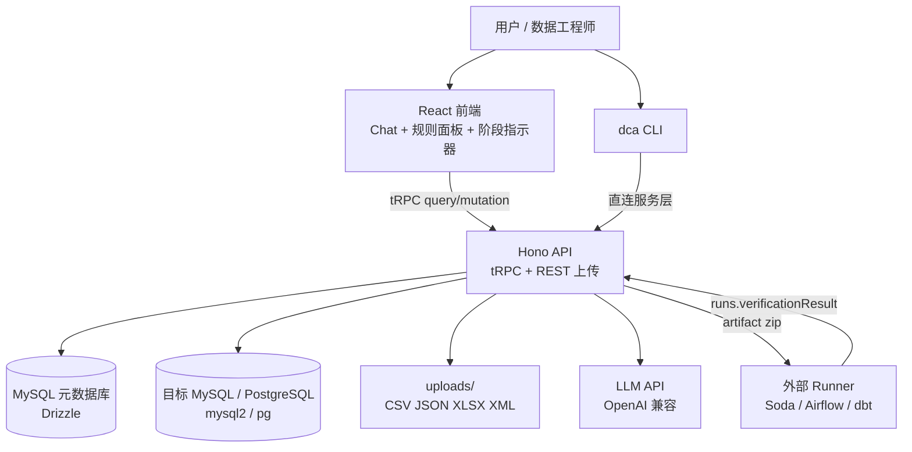
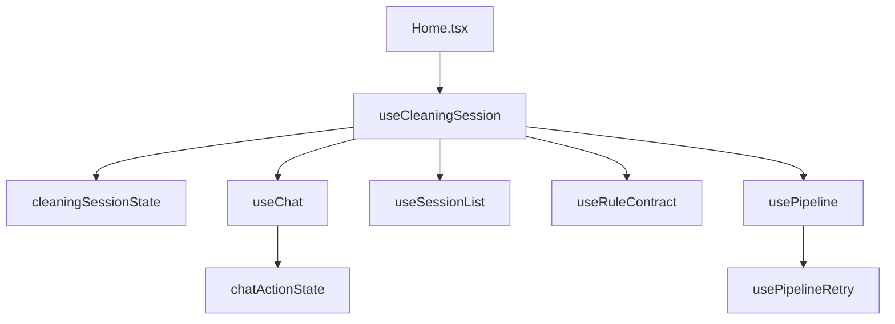
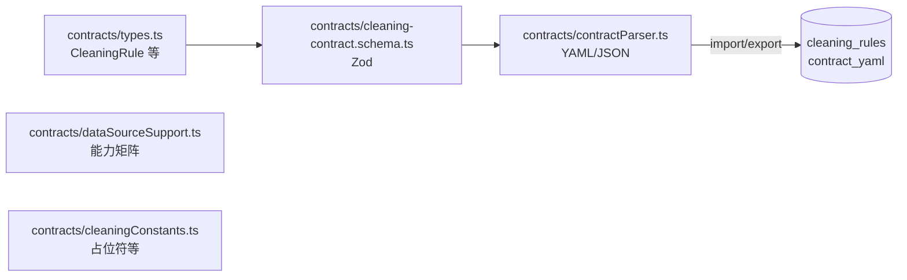
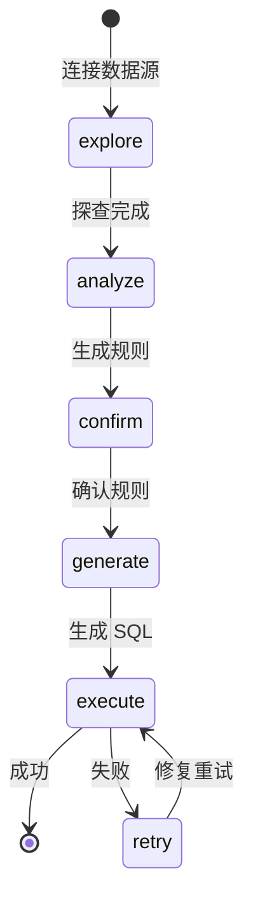
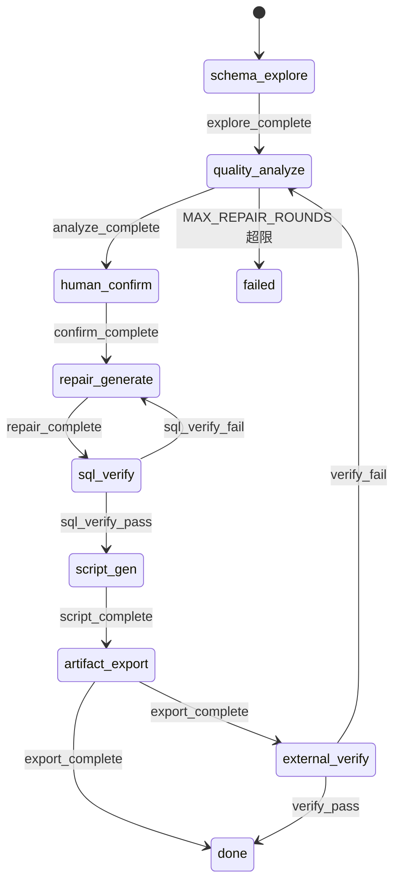
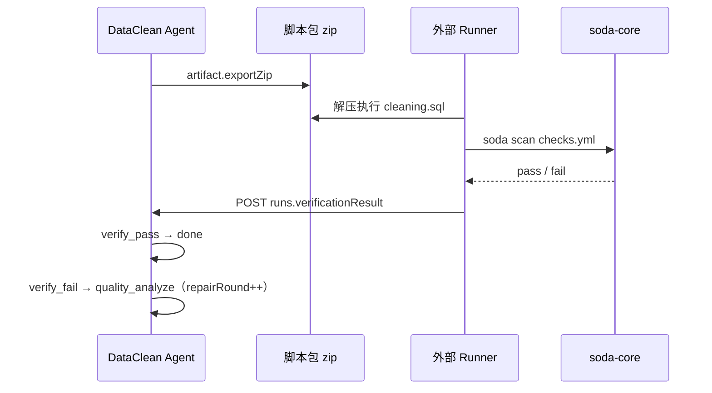
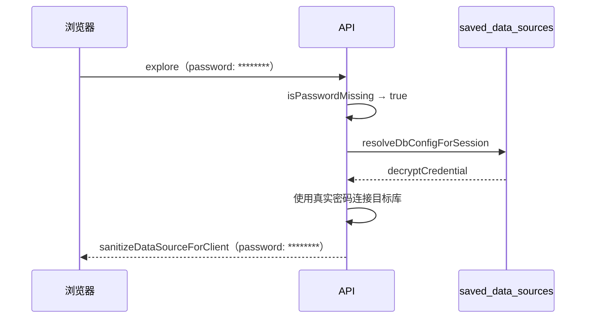
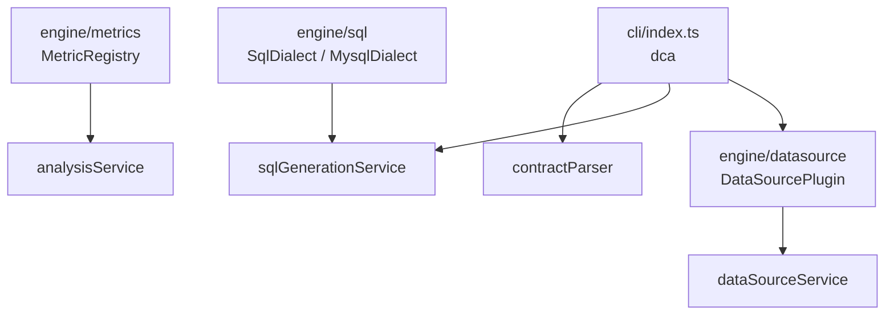

# 架构说明 — DataClean Agent

> 最后更新：2026-06-11。反映 Phase A–F 及近期安全/UX 修复后的当前实现。

## 系统上下文

## 后端模块职责

| 模块 | 路径 | 职责 |
|------|------|------|
| 路由层 | `api/routers/*` | tRPC 过程定义；mutation 经 `protectedMutation` 鉴权 |
| 编排路由 | `api/routers/orchestratorRouter.ts` | `start` / `advance` / `status` / `listBySession` |
| 运行回传 | `api/routers/runsRouter.ts` | `verificationResult` webhook |
| 脚本包 | `api/routers/artifactRouter.ts` | `exportBundle` / `exportZip` / `config` |
| 会话 | `api/services/sessionService.ts` | 会话 CRUD、消息、从 DB 组装完整状态 |
| 凭证解析 | `api/services/sessionCredentialService.ts` | 合并客户端脱敏密码与服务端真实凭证 |
| 密码脱敏 | `api/lib/dataSourceSanitizer.ts` | 下发客户端前 `********` 占位 |
| 凭证加密 | `api/lib/credentialCrypto.ts` | AES-256-GCM 存储 `saved_data_sources.db_password` |
| 数据源 | `api/services/dataSourceService.ts` | MySQL/文件探查、连接池 |
| 数据源存储 | `api/services/dataSourceStoreService.ts` | 已保存数据源与凭证 |
| 分析 | `api/services/analysisService.ts` | 质量报告、规则推荐 |
| 规则意图 | `api/services/ruleIntentService.ts` | NL 规则修改 |
| Agent 计划 | `api/services/agentService.ts` | 多步 NL 计划（chat 向后兼容） |
| SQL 生成 | `api/services/sqlGenerationService.ts` | 清洗 SQL 生成 |
| 文件清洗 | `api/services/fileCleaningService.ts` | 文件路径执行规则 |
| 执行 | `api/services/executionService.ts` | SQL 步骤执行与重试 |
| 阶段校验 | `api/services/phaseValidator.ts` | explore→execute 前置条件 |
| 编排器 | `api/agents/orchestrator.ts` | 多步状态机 + `orchestration_runs` 持久化 |
| 脚本包 | `api/services/artifactService.ts` | zip / dbt / 调度模板 |
| Soda 执行 | `api/agents/sodaRunner.ts` | 调用 soda-core CLI（可选） |
| 契约 | `api/services/contractService.ts` | 规则 ↔ YAML 契约 round-trip |
| 引擎 · 指标 | `engine/metrics/metricRegistry.ts` | 质量指标注册与 resolve 去重 |
| 引擎 · SQL 方言 | `engine/sql/mysqlDialect.ts` | MySQL 标识符引用与备份 DDL |
| 引擎 · 数据源插件 | `engine/datasource/mysqlPlugin.ts` | MySQL explore/execute 插件契约 |
| CLI | `cli/index.ts` | `dca` 命令行：explore / compile / export |
| 鉴权 | `api/lib/auth.ts` | Bearer `APP_SECRET` 校验 |
| 限流 | `api/lib/rateLimit.ts` | IP / Bearer 前缀滑动窗口 |
| 环境 | `api/lib/env.ts` | `SCRIPT_ONLY`、`MAX_REPAIR_ROUNDS` 等 |

## 前端模块职责（Hooks 拆分）

`useCleaningSession` 为门面 Hook，组合子模块并保持 `Home.tsx` API 稳定：

| 模块 | 路径 | 职责 |
|------|------|------|
| 门面 | `src/hooks/useCleaningSession.ts` | 组合子 Hook，对外统一 API |
| 状态 | `src/hooks/cleaningSessionState.ts` | 会话状态、tRPC mutations |
| 会话列表 | `src/hooks/useSessionList.ts` | 创建/加载/删除会话 |
| 规则契约 | `src/hooks/useRuleContract.ts` | 规则 CRUD、契约导入导出、脚本包 |
| 流水线 | `src/hooks/usePipeline.ts` | 探查/分析/生成/执行/Agent 计划 |
| 重试 | `src/hooks/usePipelineRetry.ts` | 失败重试、手动修 SQL |
| 对话 | `src/hooks/useChat.ts` | 消息发送、LLM 响应 |
| 按钮状态 | `src/lib/chatActionState.ts` | 快捷按钮置灰逻辑 |
| 数据源面板 | `src/components/datasource/DataSourcePanel.tsx` | 连接/上传 |
| 规则面板 | `src/components/rules/RulesPanel.tsx` | 规则确认、契约导入/导出 |
| Chat | `src/components/ChatPanel.tsx` | 对话与快捷动作 |
| 执行面板 | `src/components/execute/ExecutionPanel.tsx` | script-only 时引导导出 |
| tRPC | `src/providers/trpc.tsx` | 客户端；可选 `VITE_APP_SECRET` 请求头 |

## 共享契约层

## 清洗阶段状态机（UI / phaseValidator）

服务端 `validatePhaseTransition` 在每次阶段 mutation 前强制执行。

## 编排器状态机（Phase C — orchestration_runs）

与 UI 阶段并行存在，用于持久化多步 Agent 流水线：

| API | 说明 |
|-----|------|
| `orchestrator.start` | 创建 `orchestration_runs` 行，返回 `runId` |
| `orchestrator.advance` | 事件驱动转移 + Agent 处理器 |
| `orchestrator.status` | 查询 `state` + `context` JSON |
| `orchestrator.listBySession` | 按会话列出运行记录 |
| `chat.send` | 多步意图委托 `handleUserMessage`（与 `agentService` 并存） |

核心函数：

- `advanceOrchestrator` / `canTransition`：纯函数转移校验
- `invokeAgentHandler`：进入状态时调用对应 Agent
- `validatePhaseTransition`：作为转移守卫（explore/analyze/confirm/generate）
- `runScriptOnlyPipeline`：沿 `SCRIPT_ONLY_PIPELINE` 推进并写 DB
- `ingestVerificationResult`：外部 webhook → `verify_pass` / `verify_fail`

## api/agents 层

| Agent | 文件 | 职责 |
|-------|------|------|
| schema | `schemaAgent.ts` | 探查（DB / 文件） |
| quality | `qualityAgent.ts` | 质量报告 + 规则推荐；`diagnose()` 校验失败修补建议 |
| repair | `repairAgent.ts` | 清洗 SQL 生成 |
| verify | `verifyAgent.ts` | 静态校验 + EXPLAIN |
| scriptGen | `scriptGenAgent.ts` | Soda checks YAML |
| sodaRunner | `sodaRunner.ts` | 调用 soda-core CLI；不可用时 `skipped` |

路由委托关系：

- `exploreRouter` → `schemaAgent`
- `analyzeRouter` → `qualityAgent`
- `sqlRouter.generate` → `repairAgent`
- `sqlRouter.verify` → `verifyAgent`
- `artifactService` → `scriptGenAgent` + `orchestrator`

## 脚本包导出（Phase D — Artifact Bundle）

`artifact.exportBundle` / `exportSessionArtifactBundle` / `dca export` 产出：

| 文件 | 说明 |
|------|------|
| `cleaning.sql` | 合并清洗 SQL |
| `steps/01_*.sql` | 分步 SQL（两位序号前缀） |
| `contract.yaml` | 清洗契约（含 `artifacts` / `verification` 可选段） |
| `soda/checks.yml` | Soda Core 校验（`scriptGenAgent`） |
| `manifest.json` | 元数据、`scheduling.dbt` / `scheduling.airflow` / `webhookCallbackUrl` |
| `README.md` | 使用说明 |
| `dbt/` | 可选：`includeDbt: true` 时 staging 模型 + schema.yml |
| `scheduling/airflow/` | 可选：`includeScheduling: true` 时 DAG 片段 |
| `scheduling/deequ/` | 可选：`engine=spark` 时 PySpark 桩 |

`artifact.exportZip` / `asZip: true` 返回 base64 zip；CLI `dca export --output DIR` 写入完整目录树。

## 外部执行与反馈回环（Phase E + F）

| 模块 | 路径 | 说明 |
|------|------|------|
| runsRouter | `api/routers/runsRouter.ts` | `POST runs.verificationResult` 接收 `{ runId, status, details }` |
| sodaRunner | `api/agents/sodaRunner.ts` | 本地调用 soda-core；CLI 缺失时返回 `skipped` |
| qualityAgent.diagnose | `api/agents/qualityAgent.ts` | 校验失败时建议规则修补 |
| 反馈回环 | orchestrator | `verify_fail` + `repairRound < MAX_REPAIR_ROUNDS`（默认 3）→ `quality_analyze` |

`dca execute` 已标记弃用；推荐 `dca export` + 外部 Runner + webhook 回传。

## 鉴权与安全模型

### Bearer 鉴权

- **公开 query**：`ping`、`session.get/list`（不含敏感字段）等
- **受保护 query**：`session.getFull`、`contract.export*`、`orchestrator.status` 等（配置 `APP_SECRET` 后需 Bearer）
- **受保护 mutation**：所有写操作需 `Authorization: Bearer ${APP_SECRET}`
- 开发环境 `APP_SECRET` 为空时跳过（`NODE_ENV !== production`）

### 密码脱敏与凭证解析

| 组件 | 说明 |
|------|------|
| `MASKED_PASSWORD` | 客户端可见占位符 `********` |
| `sanitizeDataSourceForClient` | `session.getFull` / `dataSource.get` 下发前脱敏 |
| `resolveDbConfigInput` | explore / execute / verify 合并服务端真实密码 |
| `credentialCrypto` | `enc:v1:` AES-256-GCM；密钥由 `APP_SECRET` 派生 |

### 速率限制

| 端点 | 限制 |
|------|------|
| `chat.send` | 30 次/分钟 |
| `execute.run` | 30 次/分钟 |
| `POST /api/upload` | 30 次/分钟 |

键：`rateLimitKeyFromRequest`（IP 或 Bearer 前缀）。

### SCRIPT_ONLY 模式（默认）

生产环境默认 **脚本-only**：禁止对目标库真实写操作，仅生成 SQL 与可导出脚本包。

| 环境变量 | 含义 |
|----------|------|
| （默认） | `scriptOnly=true`，`allowExecute=false` |
| `ALLOW_EXECUTE=true` | 解除限制，允许 `execute` 非 dry-run |

- **API**：`executeRouter` 在 `dryRun=false` 时检查 `env.scriptOnly`
- **CLI**：`dca execute --force-execute` 需 `ALLOW_EXECUTE=true`（`cli/executeGuard.ts`）
- **前端**：`artifact.config` 查询 `scriptOnly`；Chat「执行」在 script-only 下引导导出脚本包
- **Agent 计划**：`runAgentPlanBySteps` 中 `execute` 步骤在 script-only 下强制 `dryRun=true`

## 数据模型（核心表）

| 表 | 用途 |
|----|------|
| `saved_data_sources` | 持久化数据源配置（`db_password` AES 加密） |
| `cleaning_sessions` | 会话状态、`contract_yaml` 快照 |
| `exploration_results` | 探查结果 |
| `quality_reports` | 质量报告 |
| `cleaning_rules` | 清洗规则 JSON |
| `sql_steps` | 生成的 SQL 步骤 |
| `execution_logs` | 执行记录 |
| `chat_messages` | 对话历史 |
| `orchestration_runs` | 多步编排 `state` + `context` JSON |

## 引擎层（Phase 2–3 基础）

## Docker 构建

| 文件 | 说明 |
|------|------|
| `Dockerfile` | 多阶段：`npm ci` → `npm run build` → 生产 `node dist/boot.js` |
| `docker-compose.yml` | 生产 `app`（端口 29000）；dev profile `app-dev` 挂载源码 |
| `scripts/docker-restart.sh` | `down` → `build` → `up -d`；`--fast` 跳过 rebuild |

生产镜像内代码变更需 `npm run docker:restart` 重建；开发用 `npm run docker:dev` 热更新。

## 测试基线（2026-06-11）

- `npm run check`：TypeScript 编译通过
- `npm test`：**34 个测试文件 / 164 条用例**全部通过
- 覆盖：编排器持久化、artifact bundle、runs webhook、sodaRunner、密码脱敏、鉴权、限流、契约 round-trip、CLI

## 扩展点

1. **新数据库驱动**：实现 `DataSourcePlugin` 并 `registerDataSourcePlugin`，同步 `dataSourceSupport.ts`
2. **新清洗动作**：注册 `cleaningActionRegistry.ts`，同步 analysis / sql / file 三通道
3. **契约版本**： bump `cleaning-contract.schema.ts` 的 `version` 字段
4. **Webhook 签名**：为 `runs.verificationResult` 增加 HMAC 校验（待实现）
5. **编排 UI**：前端对接 `orchestrator.*` API 展示 run 进度（待实现）
