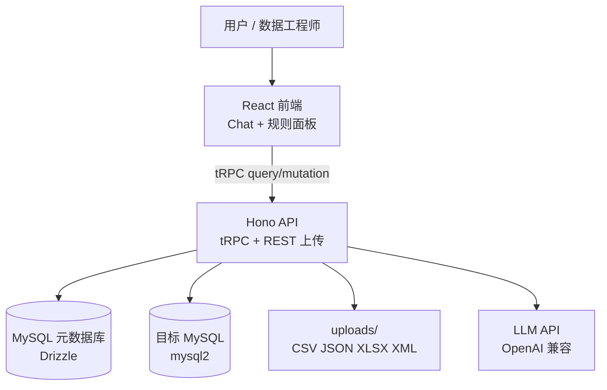
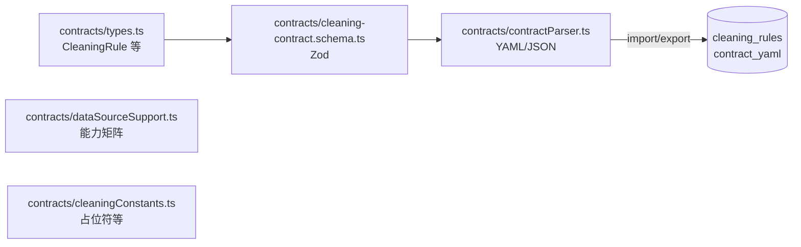
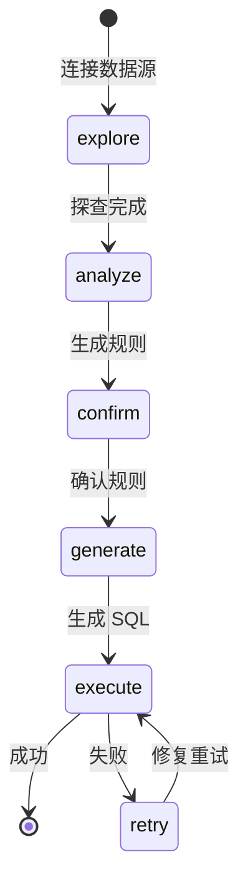
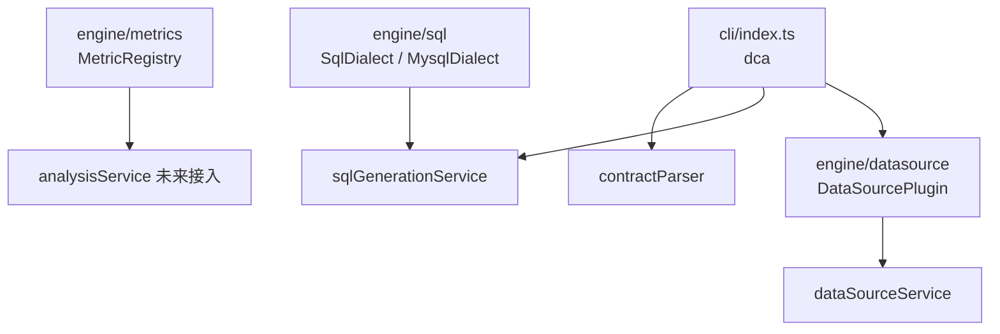

# 架构说明 — DataClean Agent

## 系统上下文

## 后端模块职责

| 模块 | 路径 | 职责 |
|------|------|------|
| 路由层 | `api/routers/*` | tRPC 过程定义；mutation 经 `protectedMutation` 鉴权 |
| 会话 | `api/services/sessionService.ts` | 会话 CRUD、消息、从 DB 组装完整状态 |
| 数据源 | `api/services/dataSourceService.ts` | MySQL 探查、文件解析、连接池 |
| 数据源存储 | `api/services/dataSourceStoreService.ts` | 已保存数据源与凭证 |
| 分析 | `api/services/analysisService.ts` | 质量报告、规则推荐 |
| 规则意图 | `api/services/ruleIntentService.ts` | NL 规则修改 |
| Agent | `api/services/agentService.ts` | 多步 NL 计划 |
| SQL 生成 | `api/services/sqlGenerationService.ts` | 清洗 SQL 生成 |
| 文件清洗 | `api/services/fileCleaningService.ts` | 文件路径执行规则 |
| 执行 | `api/services/executionService.ts` | SQL 步骤执行与重试 |
| 阶段校验 | `api/services/phaseValidator.ts` | explore→execute 前置条件 |
| 契约 | `api/services/contractService.ts` | 规则 ↔ YAML 契约 round-trip |
| 引擎 · 指标 | `engine/metrics/metricRegistry.ts` | 质量指标注册与 resolve 去重 |
| 引擎 · SQL 方言 | `engine/sql/mysqlDialect.ts` | MySQL 标识符引用与备份 DDL |
| 引擎 · 数据源插件 | `engine/datasource/mysqlPlugin.ts` | MySQL explore/execute 插件契约 |
| CLI | `cli/index.ts` | `dca` 命令行：explore / compile / execute |
| 鉴权 | `api/lib/auth.ts` | Bearer `APP_SECRET` 校验 |

## 前端模块职责

| 模块 | 路径 | 职责 |
|------|------|------|
| 会话 Hook | `src/hooks/useCleaningSession.ts` | 阶段驱动、tRPC 调用编排 |
| 数据源面板 | `src/components/datasource/DataSourcePanel.tsx` | 连接/上传；非 MySQL 显示「即将支持」 |
| 规则面板 | `src/components/rules/RulesPanel.tsx` | 规则确认、契约导入/导出 |
| Chat | `src/components/ChatPanel.tsx` | 对话与快捷动作 |
| tRPC | `src/providers/trpc.tsx` | 客户端；可选 `VITE_APP_SECRET` 请求头 |

## 共享契约层

## 阶段状态机

服务端 `validatePhaseTransition` 在每次阶段 mutation 前强制执行。

## 鉴权模型

- **公开 query**：`ping`、`session.get/getFull/list`、`contract.export*` 等只读
- **受保护 mutation**：所有写操作需 `Authorization: Bearer ${APP_SECRET}`
- 开发环境 `APP_SECRET` 为空时跳过（便于本地调试）

## 数据模型（核心表）

| 表 | 用途 |
|----|------|
| `saved_data_sources` | 持久化数据源配置（含 db 密码） |
| `cleaning_sessions` | 会话状态、`contract_yaml` 快照 |
| `exploration_results` | 探查结果 |
| `quality_reports` | 质量报告 |
| `cleaning_rules` | 清洗规则 JSON |
| `sql_steps` | 生成的 SQL 步骤 |
| `execution_logs` | 执行记录 |
| `chat_messages` | 对话历史 |

## 引擎层（Phase 2–3 基础）

## 扩展点

1. **新数据库驱动**：实现 `DataSourcePlugin` 并 `registerDataSourcePlugin`，同步 `dataSourceSupport.ts`
2. **新清洗动作**：注册 `cleaningActionRegistry.ts`，同步 analysis / sql / file 三通道
3. **契约版本**： bump `cleaning-contract.schema.ts` 的 `version` 字段
4. **CLI execute**：接入 `executionService` 与 Bearer 鉴权
